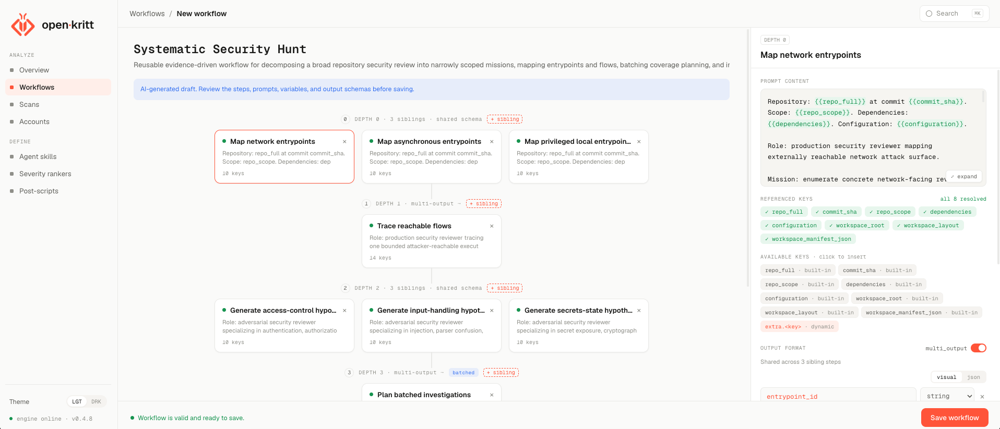

<div align="center">

<picture>
  <source media="(prefers-color-scheme: dark)" srcset="docs/images/logo-dark.png" />
  
</picture>

# open·kritt

**Orchestrate AI agents to find real vulnerabilities in code.**

An open-source, self-hosted security research platform that turns focused AI analysis
into de-duplicated, ranked findings with configurable validation and enrichment.

[](LICENSE)
[](https://github.com/Kritt-ai/open-kritt/releases)

[Website](https://kritt.ai) ·
[Documentation](https://docs.kritt.ai) ·
[Getting started](https://docs.kritt.ai/getting-started/installation-and-setup) ·
[Contributing](CONTRIBUTING.md) ·
[Research paper](https://kritt.ai/open-kritt-launch) ·
[Discord community](https://t.co/WzXMUKWxcR) ·
[Twitter](https://x.com/Kritt_AI)

</div>



## What is open·kritt?

Pointing a model at an entire repository and asking it to find vulnerabilities rarely
works well. open·kritt takes a focused approach: break the research into small,
well-defined tasks, run them across AI agents in parallel, and combine their output into
findings you can validate and prioritize.

It is built for security researchers and security-minded developers who want control
over their prompts, workflows, model providers, and infrastructure.

### What it does

- **Build workflows** — chain focused prompts into reusable security research playbooks.
- **Run scans** — analyze remote or local repositories and their dependencies with Codex
  or Claude Code.
- **Verify findings** — use post-scripts to validate issues, build proofs of concept, and
  produce reports.
- **Prioritize results** — apply custom severity rankers, a consistent finding schema,
  and automatic de-duplication.
- **Bring your own model access** — use a Codex login or connect through OpenAI,
  Anthropic, or OpenRouter.

> **Built from real security research.** The Kritt team has earned over **$1,500,000 in
> bug-bounty payouts** under the researcher name **Blockian**
> ([Immunefi](https://immunefi.com/profile/Blockian/) ·
> [HackenProof](https://hackenproof.com/hackers/Blockian) ·
> [blockian.xyz](https://blockian.xyz) · [@ControlZ_1337](https://x.com/ControlZ_1337)).
> open·kritt is the open-source distillation of the internal project behind that work.

## Getting started

You need Git, Docker with Docker Compose, and Node.js 20 or newer. The repository-local
CLI has no install step.

```bash
git clone https://github.com/Kritt-ai/open-kritt
cd open-kritt
./kritt setup
./kritt start
```

Open [http://localhost:5173](http://localhost:5173) once the stack is running. You only
need one model-access option; `./kritt setup` guides you through the available logins and
API keys. A `GITHUB_TOKEN` is optional and only needed for private GitHub repositories.

The default ports bind to `127.0.0.1`, and the backend does not include application
authentication. Keep the stack private.

Tool-enabled agents run as root inside disposable job containers, with writable repository
copies and direct internet access so they can install tools, compile targets, run tests,
and build proofs of concept. Run open·kritt on a dedicated Docker host or VM; see the
[threat model](docs/threat-model.md) before scanning untrusted code.

For prerequisites, manual Docker setup, and provider-specific instructions, read the
[installation guide](docs-site/getting-started/installation-and-setup.mdx) and
[AI provider setup](docs-site/ai-provider-setup/overview.mdx).

## Documentation

Preview the documentation locally with Mint:

```bash
npm install -g mint
cd docs-site
npm run dev
```

Open [http://localhost:3001](http://localhost:3001) to view the site.

- [Product overview](docs-site/getting-started/welcome.mdx)
- [Run your first scan](docs-site/first-scan/workflow.mdx)
- [Workflows and prompt steps](docs-site/workflows/steps.mdx)
- [Security and threat model](docs/threat-model.md)

## Community and contributing

Questions and ideas belong in [GitHub Discussions](https://github.com/Kritt-ai/open-kritt/discussions).
Use [GitHub Issues](https://github.com/Kritt-ai/open-kritt/issues) for bugs and feature
requests.

Contributions are welcome. Read [CONTRIBUTING.md](CONTRIBUTING.md) for the development
setup, test commands, Conventional Commits, and DCO sign-off requirements.

Please report security vulnerabilities privately by following [SECURITY.md](SECURITY.md), not through a public issue.

## License

open·kritt is licensed under the [GNU Affero General Public License v3.0](LICENSE).
